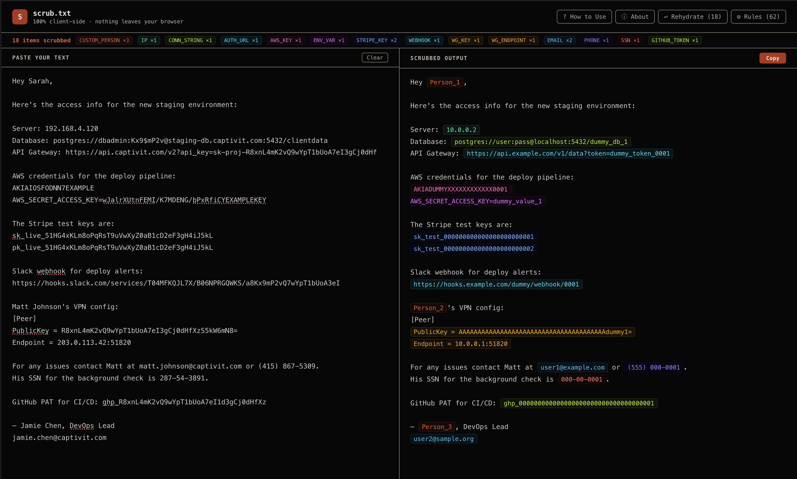
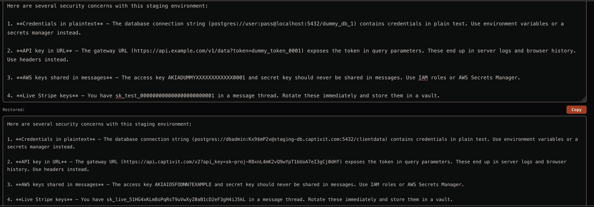
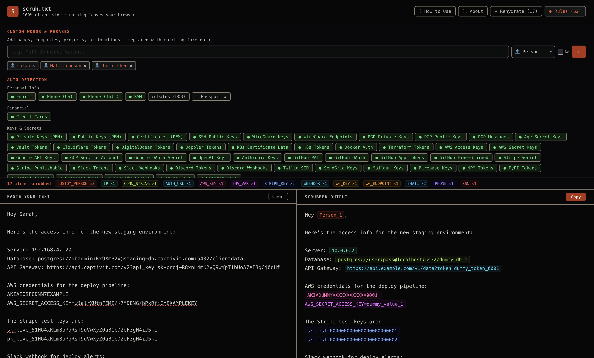

# scrub.txt

**Stop leaking sensitive data to AI.**

scrub.txt detects and replaces emails, API keys, private keys, phone numbers, and 50+ other sensitive data formats with realistic dummy values — then restores your originals in the AI's response. Everything runs in your browser. Nothing ever leaves.

[](LICENSE)
[](CONTRIBUTING.md)
[](#detection-patterns)
[](#privacy)

**[Try it live →](https://scrub-txt.vercel.app)**

---



## The Problem

Every day, millions of people paste sensitive data into AI services — emails, API keys, database credentials, internal project names, customer information. Once it's in the prompt, it's on someone else's server.

Enterprise DLP tools cost thousands and require IT to deploy. Most people have nothing.

## The Solution

1. **Scrub** — Paste your text. Sensitive data is automatically detected and replaced with realistic fakes.
2. **Use AI** — Copy the scrubbed text into ChatGPT, Claude, Gemini, or any AI service. It works normally because the fake data looks real.
3. **Rehydrate** — Paste the AI's response back. All dummy values are swapped back to your originals.

You get a fully personalized AI response. The AI never saw your real data.



## Why Realistic Fakes?

Most scrubbing tools replace data with tags like `[EMAIL_1]` or `[REDACTED]`. This breaks the AI's ability to reason about the text naturally. scrub.txt uses realistic dummy values instead:

| Real Data | scrub.txt | Other Tools |
|-----------|-----------|-------------|
| `matt@acme.com` | `user1@example.com` | `[EMAIL_1]` |
| `(555) 867-5309` | `(555) 000-0001` | `[PHONE_REDACTED]` |
| `sk-proj-abc123...` | `sk-dummy-key-000...` | `[API_KEY]` |
| `Acme Corp` | `Company_1` | `[COMPANY_1]` |
| `Project Falcon` | `Project_1` | `[PROJECT_1]` |

The AI reads `user1@example.com` as a normal email and responds naturally. Tags like `[EMAIL_1]` get flagged, questioned, or produce awkward output.

## Custom Rules

Auto-detection catches structured patterns (emails, keys, IPs), but can't know that "Sarah" is your coworker or "Falcon" is your project name.

Add custom words and phrases with type-aware replacements:

| Type | Example | Replaced With |
|------|---------|---------------|
| 👤 Person | `Sarah`, `Matt Johnson` | `Person_1`, `Person_2` |
| 🏢 Company | `Acme Corp` | `Company_1` |
| 📁 Project | `Project Falcon` | `Project_1` |
| 📍 Location | `123 Main St` | `Location_1` |
| 🏷️ Other | `Confidential` | `REDACTED_1` |



## Detection Patterns

55+ built-in patterns across 5 categories, all toggleable:

**Personal Info** — Emails, US/international phones, SSNs, dates of birth, passport numbers

**Financial** — Credit card numbers

**Keys & Secrets** — AWS, GCP, GitHub, Stripe, Slack, Discord, OpenAI, Anthropic, WireGuard, PGP/GPG, SSH, PEM private/public keys, certificates, Age encryption, Hashicorp Vault, Cloudflare, DigitalOcean, Doppler, Kubernetes, Docker, Terraform, Twilio, SendGrid, Mailgun, Firebase, NPM, PyPI, Vercel, Supabase, Shopify, Azure, Datadog

**Auth & Config** — JWTs, Bearer tokens, Basic Auth, auth URLs, connection strings, environment variables, password assignments, generic secrets

**Network** — IPv4, IPv6, MAC addresses

## Privacy

scrub.txt is 100% client-side. This isn't a marketing claim — it's a verifiable architectural guarantee.

- **Zero network calls** after page load. Open your browser's Network tab and check.
- **Zero storage.** No localStorage, cookies, or IndexedDB. Close the tab and everything is gone.
- **Zero dependencies in the engine.** The core scrubbing logic has no imports beyond itself.
- **Zero analytics.** No tracking, no telemetry, no pixels.
- **Works offline.** Install as a PWA, turn off WiFi, it still works.
- **Open source.** Read every line of code yourself.

See [SECURITY.md](SECURITY.md) for verification steps and our security policy.

## Quick Start

```bash
git clone https://github.com/springdom/scrub-txt.git
cd scrub-txt
npm install
npm run dev
```

Opens at `http://localhost:5173`.

To build for production:

```bash
npm run build
```

Output in `dist/` — a static site you can host anywhere.

## Architecture

```
src/
├── App.jsx              # Entire UI (single component)
├── main.jsx             # React entry point
├── index.css            # Global styles
└── lib/
    ├── patterns.js      # 55+ detection patterns
    ├── generators.js    # Fake data factories per type
    ├── engine.js        # scrub() + rehydrate() pure functions
    └── colors.js        # Tag color assignments
```

The engine is framework-agnostic — `scrub()` and `rehydrate()` are pure functions that take strings in and return strings out. Same core logic can power a CLI, browser extension, or VS Code plugin.

**Stack:** React + Vite. Two runtime dependencies (react, react-dom). PWA via vite-plugin-pwa. ~55KB gzipped.

## Contributing

Contributions are welcome! The easiest way to help is adding new detection patterns. See [CONTRIBUTING.md](CONTRIBUTING.md) for the full guide.

```js
// Adding a pattern is this simple:
{
  id: 'service_key',
  label: 'Service Name Keys',
  enabled: true,
  regex: /your-regex-here/g,
  tag: 'API_KEY',
  group: 'Keys & Secrets',
}
```

## Roadmap

- [ ] Browser extension — scrub directly inside ChatGPT/Claude
- [ ] Name dictionary — auto-detect common names without custom rules
- [ ] File drop — drag in `.env` files, configs, logs
- [ ] CLI tool — `cat config.yml | scrub`
- [ ] VS Code extension — scrub before sharing code
- [ ] Local NER model — in-browser named entity recognition via Transformers.js

## License

[MIT](LICENSE) — use it for anything.
